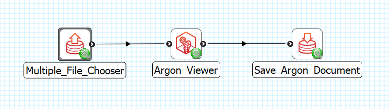
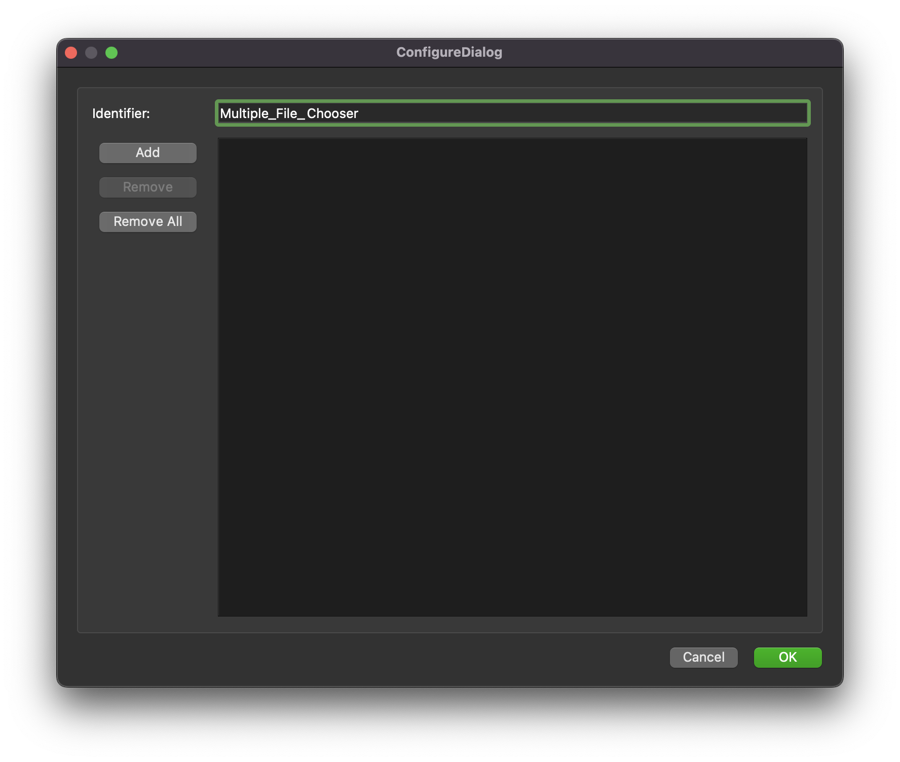
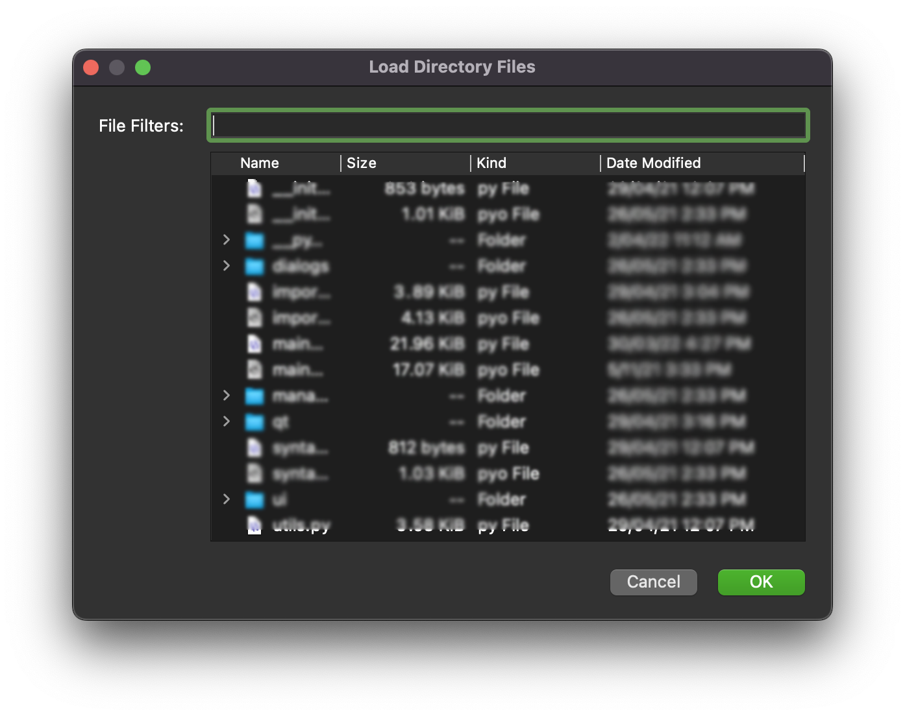

Multiple File Chooser
=====================

Overview
--------

The **Multiple Multiple File Chooser** is a MAP Client plugin for choosing multiple files from the local disk.

Workflow Connections
--------------------

As shown in :numref:`fig-mcp-multiple-file-chooser-workflow-connections`, the **Multiple File Chooser** does not need any input.

It produces 1 output which may be piped to other workflow steps:

1. A list of locations where the files are on the local disk. (Port: A *list-of* *http://physiomeproject.org/workflow/1.0/rdf-schema#file_location*) 

.. _fig-mcp-multiple-file-chooser-workflow-connections:

   **Multiple File Chooser** workflow connections.

Configure
---------

This step is used for selecting multiple files and providing them as a list of filenames.
Use the *Add* button to choose a directory to select files from.
Use the *Remove* button to remove selected files.
Use the *Remove ALL* button to remove all files listed.

.. _fig-mcp-multiple-file-chooser-configure-dialog:

   *Multiple File Chooser* step configuration dialog.

The *Add* button opens a directory chooser dialog.
Once a directory is chosen the :numref:`fig-mcp-multiple-file-chooser-load-directory-files` is shown to choose which files to load from the directory.

The `Load directory files <fig-mcp-multiple-file-chooser-load-directory-files>`_ dialog has a file filters input where basic regular expressions can be entered to filter the files that are to be added.
For example, :code:`*.py` will filter all files ending in :code:`.py`, commonly Python files.
The `Load directory files <fig-mcp-multiple-file-chooser-load-directory-files>`_  is aggressive, in that it will recurse into sub-directories to find files that match the filter expression.
If no filter expression is entered, then all files found in the directory and sub-directories will be added.

.. _fig-mcp-multiple-file-chooser-load-directory-files:

   *Multiple File Chooser* step load directory files dialog.

